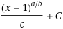

# Level Ups

The experience curve we are using:

And using these values:

| Var | Value |
| --- | ----- |
| *a* | 10    |
| *b* | 5     |
| *c* | 5     |
| C   | 10    |

Anything fractional is rounded down to the nearest integer.

| Level | XP from `level - 1` to get there |
| ----- | -------------------------------- |
| 1     | 10                               |
| 2     | 10                               |
| 3     | 10                               |
| 4     | 11                               |
| 5     | 13                               |
| 10    | 26                               |
| 15    | 49                               |
| 20    | 82                               |
| 25    | 125                              |
| 50    | 451                              |
| 75    | 1105                             |
| 100   | 1970                             |
